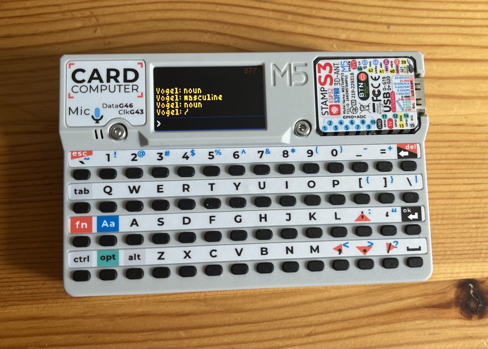

# M5Cardputer pocket translator (de-en)

I'd had a M5Cardputer on a door frame, idling for 6 months. It was time to do something with it.

## Getting this to run

For hardware, you will need:

- Micro SD card with at least 128 MB for the dictionaries (I use a 1 GB one),
- M5Cardputer,
- USB C cable,
- Computer to program the thing.

For software, as setup:

- Arduino IDE,
- sqlite3 command line.

On the Arduiono IDE, add the board for `M5Stack`, and the library `M5Unified` (and possibly `M5Cardputer` and `M5GFX`, although I think these will come together with M5Unified). This is the base setup to work with the Cardputer. Add `Sqlite3Esp32` to get a working SQLite library.

Now, on your computer you should download the `de-en.sqlite3` and `de.sqlite3` dictionaries from [WikDict](https://www.wikdict.com/page/download), in the SQLite downloads section. You will need to tweak both files with the `sqlite3` command line, the details are in the following subsections.

### Tweaking `de.sqlite3`

I dropped essentially _everything_ because this file was too large for my 1 GB SD card when including the `form` table. This table is likely also too large to be queried anyway, regardless of how many indexes we add to it. An ESP32 is not _that_ powerful.

```
DROP TABLE importance;
DROP TABLE rel_importance;
DROP TABLE form;
VACUUM;
```

Once this is done, we need to speed up querying by term:

```
CREATE INDEX idx_word_rep ON entry (written_rep);
```

Now you can

```
.quit
```

### Tweaking `de-en.sqlite3`

This view seems incompatible with the ESP32 Sqlite library.

```
DROP VIEW translation_grouped;
```

And again, we need an index:

```
CREATE INDEX idx_word_rep ON translation (written_rep);
```

Won't hurt to vacuum before leaving:

```
VACUUM;
.quit
```

---

Add both files to your micro SD card, and put it into your Cardputer.

## Usage

- The only mode is German - English. 
- Type any word, there is no need to capitalise the first letter. So, query for `vogel` when searching for `Vogel`.
- Write `.vowel` (as in `.o`) instead of umlauts. So, query for `fl.ote` when searching for `Flöte`.
- Write `ss` instead of `ß`. So, query for `strasse` when searching for `Straße`.
- Press `enter`, labelled as `ok` on the device to search.
- This will give you the translation(s) to English, if any are found. This comes from the `de-en.sqlite3` dictionary.
- TODO have some sort of _not found_.
- Pressing `/` will switch to the `de.sqlite3` dictionary, and display the part of speech (noun, verb, adverb, etc.) and the gender (if it is a noun).
- Pressing `,` will go back to the translation view.
- You can keep querying by typing another word at any time.
- TODO Save the queried words to some sort of history file (or history sqlite3 database).
- TODO Optionally (prefixing with some symbol) switch to English - German, or other language pairs even.

## Some pictures

Feel free to change the font (you will need to adjust the font size factor `TEXTSIZE`). I found this one to be the most legible one.

I could not figure out how to get the font to display (after the search is executed) umlauts or eszetts correctly. They will show as "unknown" boxes, but since it's part of what you searched for you should know what is there anyway.





